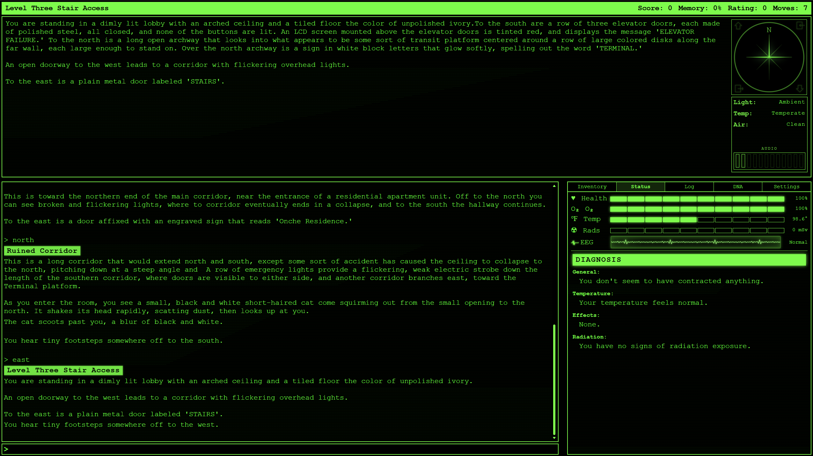
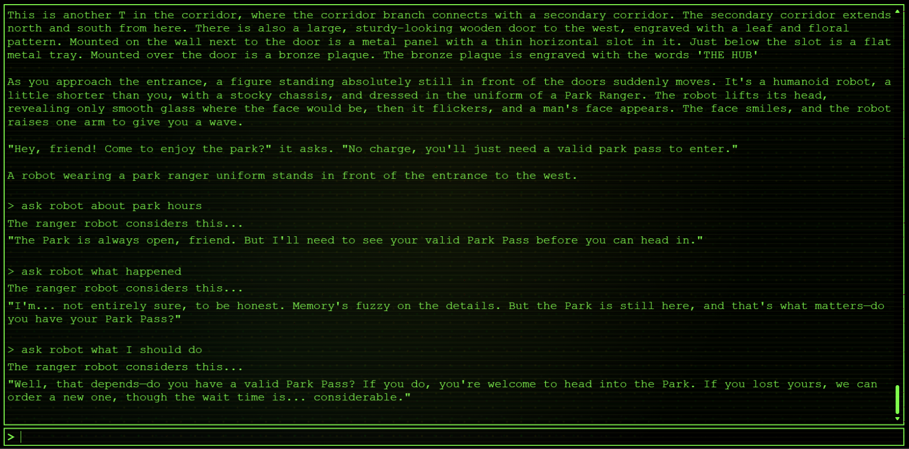
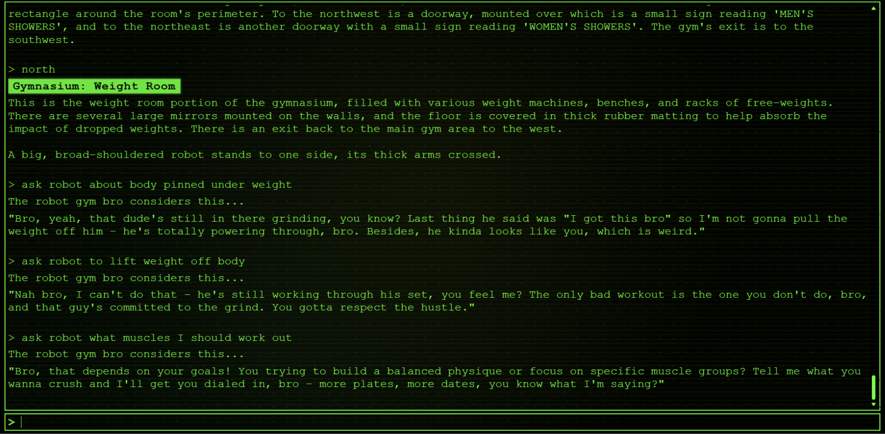
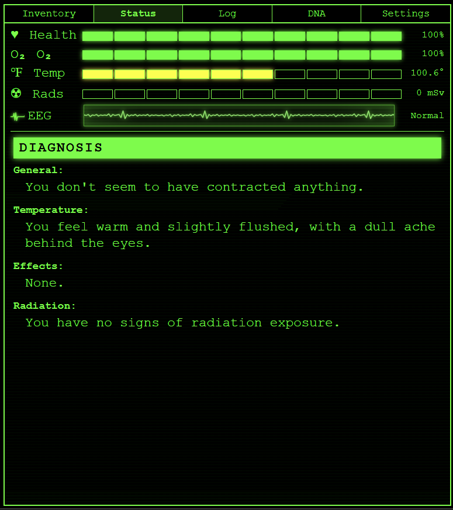
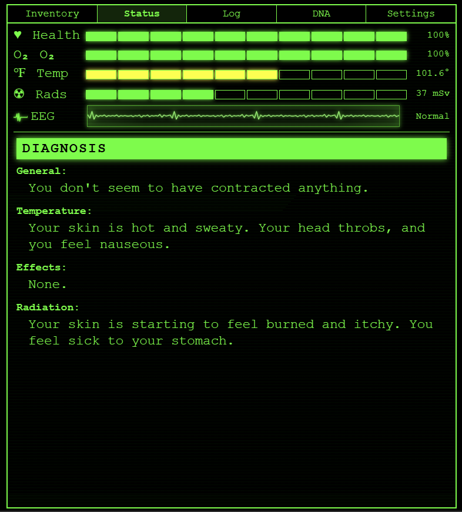
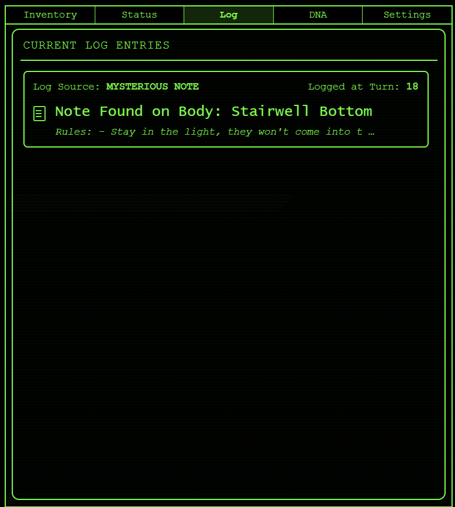
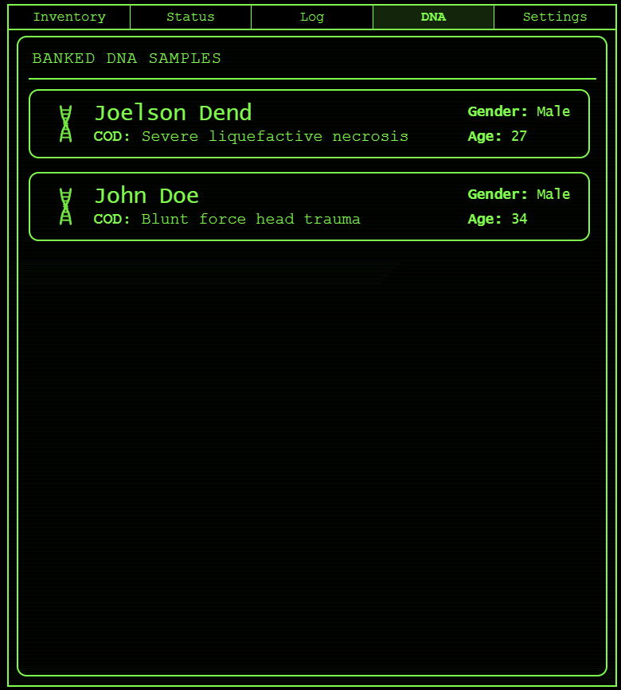

# AYSF Game Frontend

AYSF is a browser-based interactive fiction game built with React, TypeScript, and Vite. The frontend renders the command-line style interface, room and world state, UI overlays, and puzzle systems for a large sci-fi survival adventure aboard a failing ship.

The project is playable as a standalone frontend. When the optional backend is running, selected NPC conversations can be upgraded with Claude-generated responses; if the API is unavailable, the game falls back to authored dialog.

## Highlights

- Command-driven interactive fiction interface with parser-based input
- Large multi-level world assembled from deferred-loaded map chunks
- Rich room presentation with CRT styling, overlays, modal interactions, and status effects
- Inventory, score, memory, and hint systems integrated into the main UI
- AI-assisted NPC conversations with safe frontend fallback behavior
- Frontend test coverage for game logic, UI flows, and regression scenarios

## Tech Stack

- React 19
- TypeScript
- Vite
- Zustand
- Vitest + Testing Library

## Screenshots

### Main Game



### AI Conversations




### Status Tab

<p align="center">
  
  
</p>

### Game Logs

<p align="center">
  
  
</p>

## Project Layout

```text
src/
  game/      Core game loop, actions, state, UI components, services
  world/     Rooms, maps, doors, items, creatures, chunk definitions
  parse/     Command parser
  hints/     Hint content and hint UI
  test/      Frontend and gameplay tests
server/      Optional backend for Claude-powered NPC conversations
```

## Requirements

- Node.js 20+ recommended
- `pnpm`

## Quick Start

### Frontend only

```bash
pnpm install
pnpm run dev
```

The Vite dev server runs at `http://localhost:5173`.

### Frontend + AI conversation server

```bash
pnpm install
cd server
pnpm install
cp .env.local.example .env.local
```

Add your Anthropic API key to `server/.env.local`, then return to the repo root and run:

```bash
pnpm run dev:full
or
pnpm run start
```

Convenience launchers are also included:

- Windows: `start-game.bat`
- macOS/Linux: `start-game.sh`

## Available Scripts

From the repo root:

- `pnpm run dev` starts the frontend only
- `pnpm run dev:server` starts the backend from the root workspace
- `pnpm run dev:full` starts frontend and backend together
- `pnpm run start` aliases `dev:full`
- `pnpm run build` builds the frontend for production
- `pnpm run build:server` builds the backend
- `pnpm run preview` serves the production frontend build locally
- `pnpm run lint` runs ESLint
- `pnpm run test` runs the frontend test suite once
- `pnpm run test:watch` runs tests in watch mode
- `pnpm run drift:check` checks world data for new placeholder drift

## Gameplay Input

The parser supports short text commands and direction aliases. Common examples:

```text
look
inventory
diagnose
n
go east
examine terminal
take badge
open locker
use radio
ask ranger about reactor
tell voice about power
```

## Frontend Architecture Notes

- `src/game/Game.tsx` owns the top-level reducer, async command flow, deferred world loading, and layout state.
- `src/parse/parser.ts` converts user text into structured commands consumed by the action system.
- `src/game/actions/` contains verb handlers and dispatch logic.
- `src/world/` contains authored game content: rooms, items, doors, maps, and creature behavior.
- `src/game/services/claudeClient.ts` calls the backend API in development through the Vite `/api` proxy and falls back gracefully when the server is unavailable.

## Testing

The frontend test suite covers parser behavior, UI rendering, smoke coverage for action handlers, map progression, puzzle regressions, and conversation state behavior.

Run:

```bash
pnpm run test
```

## Backend Integration

The frontend proxies `/api/*` to `http://localhost:3001` in development via `vite.config.ts`. Production assumes the frontend and API are served from the same origin under `/api`.

For backend setup and API details, see [server/README.md](./server/README.md).
